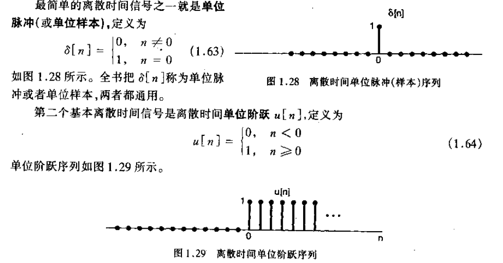

# 数字信号处理

+ 信息
+ 消息
+ 信号

**信号的分类：**

+ 连续信号
+ 模拟信号：任意时刻取值是连续的连续信号，自变量与因变量都是连续的
+ 离散信号：信号仅在规定的离散时刻有定义
+ 数字信号：取值为离散的离散信号，自变量与因变量都是离散的

------

**连续信号的描述：**

+ 函数描述：$x(t) = \sin(t)$
+ 波形描述

**离散信号的表示：**

+ 函数表示
+ 波形表示
+ 列表表示
+ 序列的表格表示

------

系统对信号进行加工变化和处理，与信号相互依存，本课主要研究对数字信号的处理，掌握类比能力

**信号处理与人工智能：**

+ 应用：随机傅里叶级数用于SVM，使用信号滤波观点分析图神经网络
+ 类比：信号的卷积和卷积神经网络，信号的表示和PCA

------

**复习：复数知识**

+ 直角坐标表示
+ 极坐标表示
+ 共轭复数以及共轭复数的性质
+ 三角函数与复数，欧拉公式

------

## 信号的时域分析

+ 确定信号与随机信号

+ 周期信号：

  + 连续周期信号
  + 离散周期信号

  若两个函数周期之比是有理数，则两个函数和仍然是周期函数，周期是两个周期的最小公倍数

  离散信号可以视为连续信号与周期脉冲的乘积，离散信号的周期性和连续信号以及周期脉冲信号的周期有关

  + 能量信号与功率信号
  + 一维信号与多维信号
  
+ 信号的尺度变换

+ 信号的翻转和时移

+ 信号的加和乘

+ 信号的微分和积分

+ 欧拉公式：$e^{ix} = \cos (x)+ i\sin (ix)$

**信号的运算**：

+ 离散信号和连续信号的翻转与时移

**基本连续信号：**

+ 直流信号：$x(t) = A, -\infin < t < \infin$
+ 正弦信号：$x(t) = A\sin(\omega_0 t + \phi)$
+ 实指数信号：$x(t) =Ae^{\alpha t}$, $A和\alpha是实数$
+ 虚指数信号：$\alpha为纯虚数$，可以通过欧拉公式建立与正弦信号的关联
+ 具有指数衰减振幅的正弦信号称为**阻尼正弦振荡**

+ 抽样信号：$Sa(t) = \frac{\sin t}{t}$

**基本离散时间序列：**

+ 虚指数序列：$x[n]=e^{j\omega_on}$，$2\pi$是一个$\omega_0$的周期，不具有随$\omega_0$增加而增加震荡速率的性质，$\omega_0N=m2\pi$时，m与N是互斥的正整数时，信号是周期信号

**离散时间单位脉冲：**

+ 单位脉冲序列：
+ 单位阶跃序列：

**离散信号的差分和求和：**

**奇异信号：**

+ 单位阶跃信号

**冲激信号：**

+ 冲激信号的性质：展缩特性，$\delta(at) = \frac{1}{|a|}\delta(t)$

**信号的分解：**

+ 主成分分解：PCA
+ 信号的向量表示
+ 正交函数，正交函数集

+ 直流分解与交流分解
+ 奇分量与偶分量

